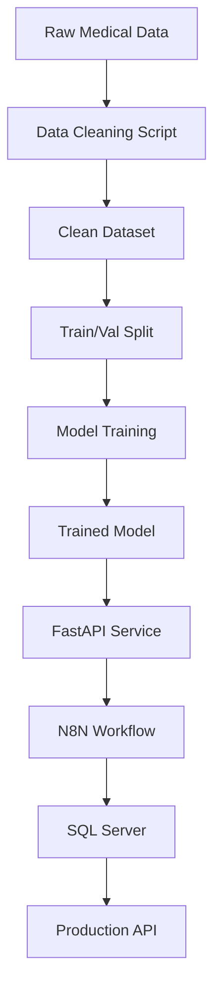

# 🔧 Technical Implementation Guide

## 🏗️ System Architecture Deep Dive

### 📊 Data Pipeline Architecture


---

## 💻 Implementation Details

### 1. Data Cleaning Process (`scripts/clean_data.py`)

```python
import pandas as pd
import re
from googletrans import Translator

def clean_medical_data(raw_data_path):
    """
    Complete data cleaning pipeline
    """
    
    # 1. Load raw data
    df = pd.read_csv(raw_data_path)
    
    # 2. Remove duplicates
    df = df.drop_duplicates(subset=['question'])
    
    # 3. Clean text
    df['question'] = df['question'].apply(clean_text)
    df['answer'] = df['answer'].apply(clean_text)
    
    # 4. Standardize medical terms
    df = standardize_medical_terms(df)
    
    # 5. Quality filtering
    df = filter_quality(df)
    
    # 6. Save processed data
    df.to_json('data/processed/medical_qa_clean.json', orient='records')
    
    return df

def clean_text(text):
    """Clean and normalize text"""
    if pd.isna(text):
        return ""
    
    # Remove extra whitespace
    text = re.sub(r'\s+', ' ', text)
    
    # Remove special characters but keep Thai/English
    text = re.sub(r'[^\u0E00-\u0E7Fa-zA-Z0-9\s\.\?\!]', '', text)
    
    return text.strip()

def standardize_medical_terms(df):
    """Standardize medical terminology"""
    medical_terms = {
        'โรคเบาหวาน': ['diabetes', 'เบาหวาน', 'น้ำตาลในเลือด'],
        'ความดันโลหิตสูง': ['hypertension', 'ความดันสูง', 'โลหิตสูง'],
        'ไข้หวัดใหญ่': ['influenza', 'flu', 'ไข้หวัด']
    }
    
    for standard_term, variations in medical_terms.items():
        for variation in variations:
            df['question'] = df['question'].str.replace(variation, standard_term, case=False)
            df['answer'] = df['answer'].str.replace(variation, standard_term, case=False)
    
    return df
```

### 2. Model Training Process (`scripts/train_model.py`)

```python
from transformers import AutoTokenizer, AutoModelForCausalLM, TrainingArguments, Trainer
import torch
from torch.utils.data import Dataset

class MedicalQADataset(Dataset):
    def __init__(self, data, tokenizer, max_length=512):
        self.data = data
        self.tokenizer = tokenizer
        self.max_length = max_length
    
    def __len__(self):
        return len(self.data)
    
    def __getitem__(self, idx):
        item = self.data[idx]
        
        # Format as instruction following
        prompt = f"คำถาม: {item['question']}\nคำตอบ: {item['answer']}"
        
        # Tokenize
        encoding = self.tokenizer(
            prompt,
            truncation=True,
            max_length=self.max_length,
            padding='max_length',
            return_tensors='pt'
        )
        
        return {
            'input_ids': encoding['input_ids'].flatten(),
            'attention_mask': encoding['attention_mask'].flatten(),
            'labels': encoding['input_ids'].flatten()
        }

def train_medical_model():
    """
    Train medical AI model
    """
    
    # 1. Load processed data
    with open('data/processed/medical_qa_clean.json', 'r', encoding='utf-8') as f:
        data = json.load(f)
    
    # 2. Split data
    train_data = data[:int(0.8 * len(data))]
    val_data = data[int(0.8 * len(data)):]
    
    # 3. Load base model
    model_name = "microsoft/DialoGPT-medium"
    tokenizer = AutoTokenizer.from_pretrained(model_name)
    model = AutoModelForCausalLM.from_pretrained(model_name)
    
    # Add pad token
    tokenizer.pad_token = tokenizer.eos_token
    
    # 4. Create datasets
    train_dataset = MedicalQADataset(train_data, tokenizer)
    val_dataset = MedicalQADataset(val_data, tokenizer)
    
    # 5. Training arguments
    training_args = TrainingArguments(
        output_dir=f'./models/medical_ai_model_{datetime.now().strftime("%Y%m%d_%H%M%S")}',
        num_train_epochs=3,
        per_device_train_batch_size=2,
        per_device_eval_batch_size=2,
        warmup_steps=500,
        weight_decay=0.01,
        logging_dir='./logs',
        logging_steps=10,
        evaluation_strategy="steps",
        eval_steps=500,
        save_strategy="steps",
        save_steps=1000,
        load_best_model_at_end=True,
    )
    
    # 6. Train model
    trainer = Trainer(
        model=model,
        args=training_args,
        train_dataset=train_dataset,
        eval_dataset=val_dataset,
    )
    
    trainer.train()
    
    # 7. Save model
    trainer.save_model()
    tokenizer.save_pretrained(training_args.output_dir)
    
    print(f"Model saved to {training_args.output_dir}")
```

### 3. FastAPI Integration (`fastapi/app/main.py`)

```python
from transformers import AutoTokenizer, AutoModelForCausalLM, pipeline
import torch

class MedicalAI:
    def __init__(self, model_path):
        self.tokenizer = AutoTokenizer.from_pretrained(model_path)
        self.model = AutoModelForCausalLM.from_pretrained(model_path)
        self.generator = pipeline(
            "text-generation",
            model=self.model,
            tokenizer=self.tokenizer,
            device=0 if torch.cuda.is_available() else -1
        )
    
    def generate_answer(self, question):
        """Generate medical answer"""
        prompt = f"คำถาม: {question}\nคำตอบ:"
        
        # Generate response
        result = self.generator(
            prompt,
            max_length=256,
            num_return_sequences=1,
            temperature=0.7,
            do_sample=True,
            pad_token_id=self.tokenizer.eos_token_id
        )
        
        # Extract answer
        generated_text = result[0]['generated_text']
        answer = generated_text.split("คำตอบ:")[-1].strip()
        
        return answer

# Initialize AI model
ai_model = MedicalAI("./models/medical_ai_model_20250915")

@app.post("/api/medical-qa")
def ask_medical_question(request: QuestionRequest):
    try:
        # Generate AI response
        ai_answer = ai_model.generate_answer(request.question)
        
        # Calculate confidence (simple heuristic)
        confidence = calculate_confidence(request.question, ai_answer)
        
        # Log to database
        log_interaction(request.user_id, request.question, ai_answer, confidence)
        
        return AnswerResponse(
            answer=ai_answer,
            confidence=confidence,
            sources=["Trained Medical AI Model"]
        )
    
    except Exception as e:
        raise HTTPException(status_code=500, detail=f"AI processing error: {str(e)}")

def calculate_confidence(question, answer):
    """Simple confidence calculation"""
    # Check answer length
    if len(answer.split()) < 5:
        return 0.3
    
    # Check for medical keywords
    medical_keywords = ['อาการ', 'รักษา', 'ยา', 'โรค', 'อันตราย']
    keyword_count = sum(1 for keyword in medical_keywords if keyword in answer)
    
    base_confidence = 0.6
    keyword_boost = min(keyword_count * 0.1, 0.3)
    
    return min(base_confidence + keyword_boost, 0.95)
```

### 4. N8N Workflow Automation

```json
{
  "name": "Medical AI Complete Workflow",
  "nodes": [
    {
      "name": "Medical Question Webhook",
      "type": "n8n-nodes-base.webhook",
      "parameters": {
        "path": "medical-qa",
        "responseMode": "responseNode"
      }
    },
    {
      "name": "Validate Input",
      "type": "n8n-nodes-base.function",
      "parameters": {
        "functionCode": "// Validate question input\nif (!$json.question || $json.question.length < 5) {\n  throw new Error('Invalid question');\n}\n\n// Add metadata\n$json.timestamp = new Date().toISOString();\n$json.session_id = $json.session_id || 'anonymous';\n\nreturn $json;"
      }
    },
    {
      "name": "Call FastAPI AI",
      "type": "n8n-nodes-base.httpRequest",
      "parameters": {
        "url": "http://fastapi:8000/api/medical-qa",
        "method": "POST",
        "body": "json",
        "jsonBody": "={{ $json }}"
      }
    },
    {
      "name": "Log to Database",
      "type": "n8n-nodes-base.microsoftSql",
      "parameters": {
        "query": "INSERT INTO medical_qa_log (user_id, question, answer, confidence, created_at) VALUES ('{{ $json.user_id }}', '{{ $json.question }}', '{{ $json.answer }}', {{ $json.confidence }}, GETDATE())"
      }
    },
    {
      "name": "Format Response",
      "type": "n8n-nodes-base.function",
      "parameters": {
        "functionCode": "// Format final response\nreturn {\n  status: 'success',\n  data: {\n    answer: $json.answer,\n    confidence: $json.confidence,\n    timestamp: new Date().toISOString()\n  }\n};"
      }
    },
    {
      "name": "Return Response",
      "type": "n8n-nodes-base.respondToWebhook"
    }
  ]
}
```

### 5. Database Schema & Operations

```sql
-- Complete database schema
CREATE DATABASE medical_ai;
USE medical_ai;

-- Users table
CREATE TABLE users (
    id INT IDENTITY(1,1) PRIMARY KEY,
    username NVARCHAR(50) NOT NULL UNIQUE,
    email NVARCHAR(100) NOT NULL UNIQUE,
    role NVARCHAR(20) DEFAULT 'user',
    created_at DATETIME2 DEFAULT GETDATE(),
    last_login DATETIME2
);

-- Medical Q&A interactions log
CREATE TABLE medical_qa_log (
    id INT IDENTITY(1,1) PRIMARY KEY,
    user_id NVARCHAR(50) NOT NULL,
    session_id NVARCHAR(100),
    question NVARCHAR(MAX) NOT NULL,
    answer NVARCHAR(MAX),
    confidence FLOAT,
    response_time_ms INT,
    feedback_rating INT,
    created_at DATETIME2 DEFAULT GETDATE(),
    
    INDEX IX_medical_qa_log_user_id (user_id),
    INDEX IX_medical_qa_log_created_at (created_at)
);

-- Medical knowledge base
CREATE TABLE medical_knowledge (
    id INT IDENTITY(1,1) PRIMARY KEY,
    topic NVARCHAR(100) NOT NULL,
    content NVARCHAR(MAX) NOT NULL,
    keywords NVARCHAR(500),
    confidence FLOAT DEFAULT 0.8,
    source NVARCHAR(200),
    last_updated DATETIME2 DEFAULT GETDATE(),
    
    INDEX IX_medical_knowledge_topic (topic),
    FULLTEXT INDEX FT_medical_knowledge_content (content, keywords)
);

-- Performance metrics
CREATE TABLE system_metrics (
    id INT IDENTITY(1,1) PRIMARY KEY,
    metric_name NVARCHAR(50) NOT NULL,
    metric_value FLOAT NOT NULL,
    timestamp DATETIME2 DEFAULT GETDATE(),
    
    INDEX IX_system_metrics_timestamp (timestamp)
);

-- Sample stored procedure for analytics
CREATE PROCEDURE GetQAAnalytics
    @StartDate DATETIME2,
    @EndDate DATETIME2
AS
BEGIN
    SELECT 
        COUNT(*) as total_questions,
        AVG(confidence) as avg_confidence,
        AVG(response_time_ms) as avg_response_time,
        AVG(CAST(feedback_rating as FLOAT)) as avg_rating
    FROM medical_qa_log 
    WHERE created_at BETWEEN @StartDate AND @EndDate;
    
    SELECT TOP 10 
        question,
        COUNT(*) as frequency
    FROM medical_qa_log 
    WHERE created_at BETWEEN @StartDate AND @EndDate
    GROUP BY question
    ORDER BY frequency DESC;
END;
```

---

## 🚀 Deployment & Monitoring

### Docker Production Setup
```yaml
# docker-compose.prod.yml
version: '3.8'
services:
  fastapi:
    build: .
    replicas: 3
    environment:
      - ENV=production
      - LOG_LEVEL=info
    healthcheck:
      test: ["CMD", "curl", "-f", "http://localhost:8000/health"]
      interval: 30s
      timeout: 10s
      retries: 3
    
  nginx:
    image: nginx:alpine
    ports:
      - "80:80"
      - "443:443"
    volumes:
      - ./nginx.conf:/etc/nginx/nginx.conf
      - ./ssl:/etc/ssl
    depends_on:
      - fastapi
```

### Monitoring & Alerts
```python
# Performance monitoring
import time
import psutil
from prometheus_client import Counter, Histogram, start_http_server

# Metrics
REQUEST_COUNT = Counter('medical_ai_requests_total', 'Total requests')
REQUEST_LATENCY = Histogram('medical_ai_request_duration_seconds', 'Request latency')
MODEL_CONFIDENCE = Histogram('medical_ai_confidence', 'Model confidence scores')

@app.middleware("http")
async def add_process_time_header(request: Request, call_next):
    start_time = time.time()
    
    response = await call_next(request)
    
    process_time = time.time() - start_time
    REQUEST_LATENCY.observe(process_time)
    REQUEST_COUNT.inc()
    
    response.headers["X-Process-Time"] = str(process_time)
    return response
```

นี่คือรายละเอียดการ implement ทั้งหมด ตั้งแต่ data processing จนถึง production deployment! 🚀